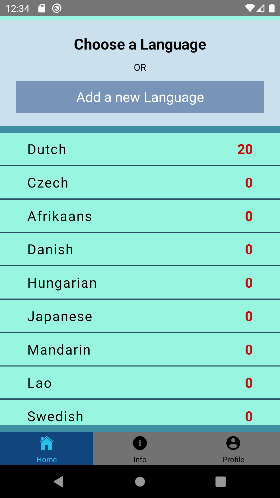

# Flashcard Repo - Mobile App

**Author** Kris Sakarias

**Version** 1.0.0


## Overview

This is a mobile application version of the [Flashcard Repo](https://github.com/kris71990/lang-flashcards.git) web app. It is built with **React Native** and **Redux**, and uses the same backend from the web application. See web application ReadMe for details of functionality. 


## Documentation

The component architecture is similar to the desktop React version. The primary difference is the utilization of `react-navigation` and associated native navigation libraries to create a blend of stack and tab navigation for an intuitive mobile UX. 

The `Root Stack` is the main navigation handler. It is composed of a Tab Navigator that allows the user to move between the `Home Stack`, `Language Info`, and `Profile` views. 

The `Home Stack` handles authenticated and non-authenticated interaction with the core functionality of the flashcard functions via stack navigation within a single tab of the tab navigator. This entails handling of login/signup, user language selections and additions, and the main flashcard view functionality. 

**Screenshots**




**Component Map**

```
              App
               | 
           Root Stack
          /    |     \
Language Info  |     Profile
               |
           Home Stack
          /     |     \
Auth Landing    |     Card Landing
          \     |     /          \    - Add Form
           Main Landing        Modals - Edit Form
            /                         - Confirm Delete
  Language Menu
  Language Choice Panel
  Translation Choice
```
